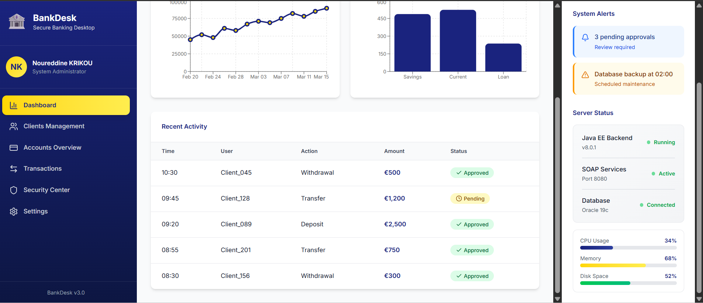
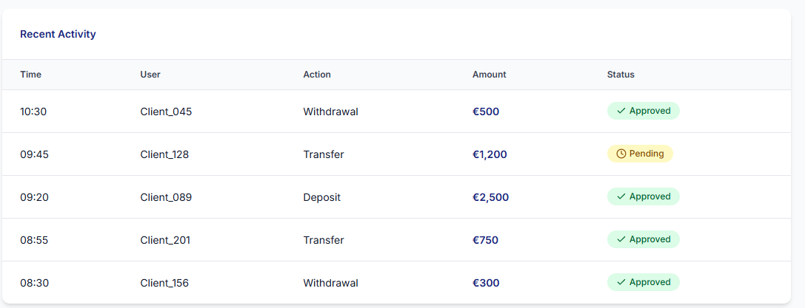
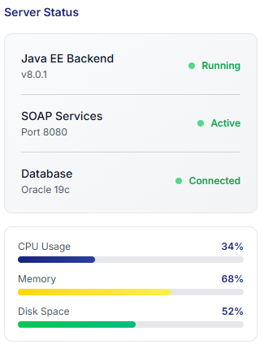

<!-- README.md - BankDesk -->

<p align="center">
  <h1 align="center">🏦 BankDesk</h1>
  <p align="center"><em>Application Desktop de Gestion des Comptes Bancaires — Java Desktop ↔ Java EE (SOAP) via Middleware</em></p>
</p>

<p align="center">
  
  
  
</p>

---

> **BankDesk** est une application **desktop Java** connectée à un **backend Java EE** via des **Web Services**.  
Elle permet la gestion complète des comptes bancaires, des opérations financières et des utilisateurs, au sein d’une **architecture distribuée orientée services (SOA)**.

---

## 🚀 Présentation du projet

**BankDesk** a été conçu pour illustrer la mise en œuvre d’une **application client–serveur robuste**, reposant sur un **middleware** assurant la communication entre :

- une **interface desktop Java** (JavaFX / Swing)
- un **backend Java EE** centralisé exposant des services métiers

L’objectif principal est de garantir :
- la **cohérence des données**
- la **sécurité des opérations**
- la **modularité et la scalabilité** du système bancaire

---

## 🎨 **Maquettes d'Interface**

### **Vue d'Ensemble du Dashboard**

*Interface principale avec sidebar, statistiques financières et monitoring système*

### **Dashboard Administrateur Détail**

*Vue administrateur avec tableau d'activité, alertes et statut des services*

### **Éléments d'Interface Détachés**

<div align="center">

| Barre de Navigation | Statistiques Centrales | Tableau des Transactions |
|---------------------|------------------------|--------------------------|
|  |  |  |
| *Menu principal avec profil utilisateur* | *KPIs financiers et graphiques* | *Historique des opérations bancaires* |

| Panneau d'Actions | Monitoring Backend |
|-------------------|-------------------|
|  |  |
| *Actions fréquentes et alertes système* | *État des services Java EE et SOAP* |

</div>

---

## ✨ Fonctionnalités principales

### 👤 Gestion des utilisateurs
- Création de comptes utilisateurs
- Authentification sécurisée
- Gestion des rôles et accès

### 💳 Gestion des comptes bancaires
- Consultation des comptes
- Création et mise à jour des comptes
- Visualisation des soldes et historiques

### 💸 Opérations financières
- Dépôts
- Retraits
- Virements entre comptes
- Validation côté serveur via services métiers

### 🔗 Communication client–serveur
- Appels via **Web Services (SOAP / REST)**
- Middleware assurant l’interopérabilité
- Backend orienté services (**SOA**)

---

## 🧠 Architecture & concepts techniques

- Architecture **distribuée**
- Séparation **Frontend / Backend**
- Middleware pour la communication
- Backend **Java EE** orienté services
- Design **modulaire et scalable**

---

## 🛠️ Technologies & outils

- **Java SE**
- **Application Desktop Java (JavaFX / Swing)**
- **Java EE**
  - EJB
  - Servlets
  - JSP
- **Web Services**
  - SOAP
  - REST
- **Middleware**
- **Architecture SOA**
- **Sécurité & authentification**
- **Communication client–serveur**

---

## 📦 Installation

### Prérequis
- Java JDK **8 ou supérieur**
- Serveur d’applications Java EE (GlassFish / WildFly / Tomcat selon configuration)
- IDE Java (**Eclipse recommandé**)

### Étapes
```bash
# Cloner le dépôt
git clone https://github.com/krikounoureddine/BankDesk---Application-Desktop-de-Gestion-des-Comptes-Bancaires.git

1. Importer le projet dans Eclipse  
2. Configurer le serveur Java EE  
3. Déployer le backend (Web Services)  
4. Lancer l’application desktop  
```

---

## ▶️ Utilisation

1. Lancer le backend Java EE  
2. Démarrer l’application desktop **BankDesk**  
3. S’authentifier avec un compte utilisateur  
4. Accéder aux comptes bancaires  
5. Effectuer des opérations financières en temps réel  

> Toutes les opérations sont validées côté serveur afin de garantir la **cohérence** et la **sécurité** des données.

---

## 🤝 Contribution

Les contributions sont les bienvenues :

1. Forker le projet  
2. Créer une branche (`feature/amelioration`)  
3. Committer vos changements  
4. Ouvrir une Pull Request  

---

## 📜 Licence

Ce projet est sous licence **MIT**.  
Vous êtes libre de l’utiliser, le modifier et le distribuer.

---

## 📫 Contact

👤 **Noureddine Krikou**  
💼 Développeur Java / Full Stack  
🌐 GitHub : https://github.com/krikounoureddine  

---

## ⭐ Pourquoi BankDesk ?

✔ Mise en œuvre concrète de **Java EE et Web Services**  
✔ Maîtrise des **architectures distribuées et middleware**  
✔ Gestion sécurisée des **opérations financières**  
✔ Projet orienté **backend, services et systèmes d’information**

> ⭐ *N’hésitez pas à laisser une étoile si le projet vous plaît !*
